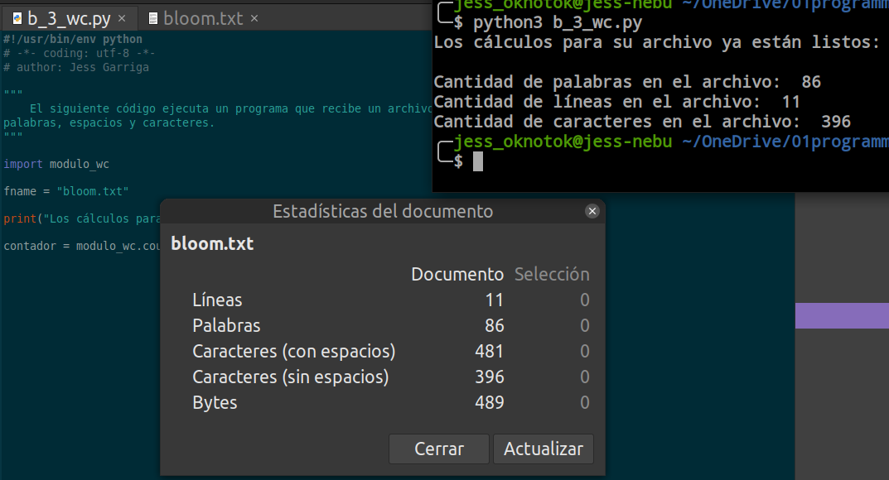

# Ejercicios integradores para el curso de Python de ADA ITW

## Diccionarios, condicionales y funciones

**Parte 1 de los ejercicios integradores**. Incluye:

- `a_1_productos.py`
- `a_2_estudiantes.py`
- `a_3_agenda.py`

---

## Ejercicios con librerias externas y archivos

**Parte 2 de los ejercicios integradores**. Incluye:

- `b_1_clima.py` con [python-weather](https://pypi.org/project/python-weather/)
    - utiliza el módulo `modulo_clima.py`
- `b_2_head.py`
- `b_3_wc.py` (contador de palabras)
    - utiliza el módulo `modulo_wc.py`
- `b_4_encuentra.py`

---

En cada archivo se detalla su programa.

Para ejecutar los códigos clonar el repositorio y correr los scripts con `python3 *.py`.

---

**Código escrito por Jess Garriga.**

**Instructor: Jeremías Cáceres.**